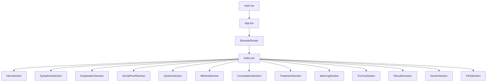
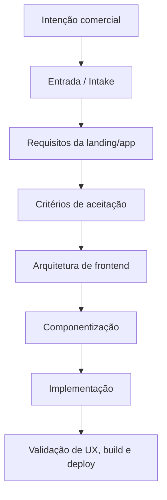

# AUTO — Elevve Clinic

> Processo AI-native para criação de apps e landing pages a partir de intenção de negócio, refinamento progressivo e implementação modular.

## Visão geral

O **AUTO — Elevve Clinic** é um case de aplicação do processo SDLC/V-Bounce para criação de uma landing page/app voltada à **Modulação Intestinal** da Elevve Clinic.

A solução foi construída como uma aplicação frontend moderna, modular e pronta para deploy, usando **React + Vite + TypeScript**, com componentes reutilizáveis, estrutura preparada para SEO, CTAs controlados e deploy em Vercel.

Mais do que uma landing page, este case demonstra o uso do processo AUTO: sair de uma intenção comercial e chegar a um artefato digital implementável, organizado e evolutivo.

## Case

- **Cliente:** Elevve Clinic
- **Projeto:** AUTO
- **Repositório:** `INNOVAI-LTDA/CLI_elevve_clinic`
- **Tipo de solução:** Landing page/app frontend para campanha clínica
- **Tema:** Protocolo de Restauração / Modulação Intestinal
- **Stack principal:** React, Vite, TypeScript, Tailwind CSS, shadcn/ui
- **Branch principal analisada:** `web_dev`

## O que é o App

O app é uma landing page de alta conversão para apresentar o protocolo de modulação intestinal da Elevve Clinic.

A experiência é estruturada em seções sequenciais que conduzem o visitante por uma jornada narrativa:

1. apresentação da promessa principal;
2. identificação de sintomas;
3. explicação do protocolo;
4. prova social;
5. método e sistema de tratamento;
6. chamada para consulta;
7. detalhes do tratamento;
8. alertas e expectativas realistas;
9. indicação de perfil ideal;
10. resultados esperados;
11. apresentação da médica;
12. perguntas frequentes.

A estrutura favorece clareza, confiança e conversão — sem jogar o visitante direto num botão de WhatsApp como quem empurra panfleto em porta de metrô.

## Estrutura do projeto

O repositório mantém a estrutura oficial em:

```text
projects/marketing/landing_pages/modulacao_intestinal/app/frontend
```

Há também uma versão legada em HTML estático preservada como referência:

```text
projects/marketing/landing_pages/modulacao_intestinal/app/frontend_v0
```

A versão ativa deve usar o diretório `app/frontend` como root de deploy na Vercel.

## Arquitetura do frontend

A aplicação é organizada em componentes React independentes.

Fluxo principal:



O `App.tsx` configura providers, roteamento e página 404. A página `Index.tsx` funciona como orquestradora da experiência, montando as seções em sequência.

## Principais componentes

- `HeroSection` — seção principal com chamada inicial;
- `SymptomsSection` — sintomas e dores do público;
- `ExplanationSection` — explicação do protocolo;
- `SocialProofSection` — prova social;
- `SystemSection` — funcionamento do sistema;
- `MethodSection` — metodologia;
- `ConsultationSection` — chamada para consulta;
- `TreatmentSection` — detalhes do tratamento;
- `WarningSection` — alinhamento de expectativas;
- `ForYouSection` — para quem é indicado;
- `ResultsSection` — resultados esperados;
- `DoctorSection` — apresentação da profissional;
- `FAQSection` — perguntas frequentes.

## Stack técnica

### Core

- React 18
- Vite 5
- TypeScript
- React Router DOM

### UI e estilização

- Tailwind CSS
- shadcn/ui
- Radix UI
- lucide-react
- class-variance-authority
- clsx
- tailwind-merge

### Formulários, validação e dados

- react-hook-form
- zod
- @hookform/resolvers
- @tanstack/react-query

### Qualidade

- ESLint
- Vitest
- Testing Library
- script de verificação de CTAs

## Scripts úteis

```bash
npm run dev
npm run build
npm run build:dev
npm run check:cta-links
npm run lint
npm run preview
npm run test
npm run test:watch
```

## Padrão de CTA

O projeto possui uma regra importante para CTAs externos:

- todo CTA externo deve usar a constante `CTA_URL`;
- links diretos de WhatsApp hardcoded em componentes são proibidos;
- o script `npm run check:cta-links` valida esse padrão antes de PR/deploy.

Esse cuidado evita espalhar links comerciais pelo código como confete em carnaval de manutenção.

## Deploy

O deploy atual deve usar:

```text
projects/marketing/landing_pages/modulacao_intestinal/app/frontend
```

como **Root Directory** na Vercel.

O build gera a pasta:

```text
dist/
```

com assets otimizados e prontos para publicação.

## Processo SDLC / V-Bounce aplicado

O projeto AUTO segue a mesma lógica de refinamento progressivo do framework SDLC AI-native/V-Bounce.

Em vez de começar pela implementação visual, o processo parte da intenção do cliente e evolui por gates:



## Como o processo aparece na prática

### 1. Entrada

A intenção do cliente é capturada em linguagem natural:

- qual serviço será promovido;
- qual público será impactado;
- qual ação final é desejada;
- quais restrições existem;
- quais mensagens são críticas.

### 2. Requisitos

A intenção vira requisitos funcionais e não funcionais:

- seções obrigatórias;
- jornada de conversão;
- SEO;
- responsividade;
- performance;
- governança de CTAs;
- deploy.

### 3. Aceitação

São definidos critérios objetivos:

- build deve passar;
- CTAs devem usar constante centralizada;
- não deve haver links diretos de WhatsApp nos componentes;
- a página deve renderizar rota principal e 404;
- a estrutura deve ser publicável na Vercel.

### 4. Arquitetura

A arquitetura separa:

- shell da aplicação;
- roteamento;
- página principal;
- componentes de seção;
- componentes base de UI;
- assets;
- configurações de build/deploy.

### 5. Modularização

Cada seção da landing vira um componente independente. Isso permite manutenção, teste, reordenação e evolução sem transformar o `index.html` num pergaminho sagrado de 4.000 linhas.

### 6. Validação

A entrega pode ser validada por:

- build;
- lint;
- testes;
- verificação de CTA;
- revisão visual;
- conferência de SEO e responsividade;
- deploy preview.

## Diferença em relação à versão legada

A versão antiga era baseada em HTML estático. A nova versão migra para uma arquitetura moderna:

| Aspecto | Versão legada | Nova versão |
|---|---|---|
| Tecnologia | HTML estático | React + Vite + TypeScript |
| Estrutura | Monolítica | Modular por componentes |
| Manutenção | Mais difícil | Mais previsível |
| Deploy | Manual/simples | Vercel-ready |
| Testes | Ausentes ou limitados | Vitest + Testing Library |
| UI | Estática | Componentes reutilizáveis |
| SEO | Manual | Estruturado no app |

## Valor entregue

O projeto AUTO entrega valor em duas camadas:

### Para o cliente

- presença digital mais profissional;
- jornada clara para conversão;
- comunicação do protocolo clínico;
- página pronta para campanha;
- estrutura preparada para SEO e analytics.

### Para o time de desenvolvimento

- base modular;
- deploy previsível;
- governança de CTAs;
- testes e lint;
- arquitetura documentada;
- evolução futura mais simples.

## Próximos passos recomendados

- conectar analytics real de produção;
- validar copy com dados de conversão;
- criar testes para componentes críticos;
- implementar tracking de eventos de CTA;
- documentar critérios de aceite por seção;
- criar playbook AUTO para replicar o processo em novos clientes.

## Status

Aplicação frontend estruturada, com arquitetura documentada, build moderno, componentes modulares e deploy orientado à Vercel.
